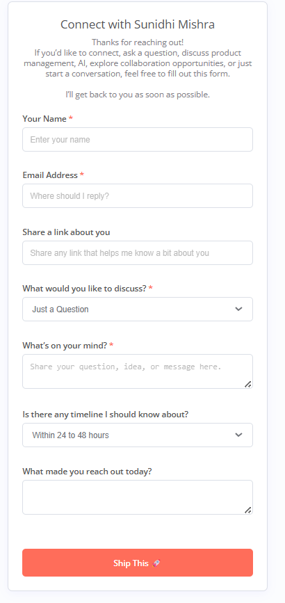
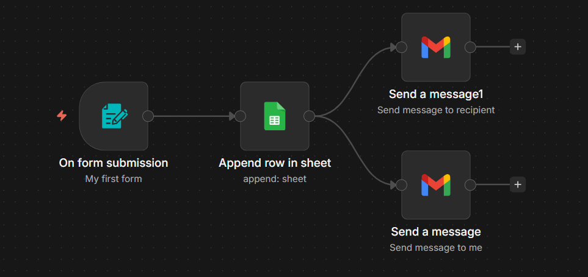

# 🚀 Automated Form to Notification Workflow (n8n)

## 📌 Overview
This project automates end-to-end handling of inbound form submissions — from capturing user input to storing structured data and triggering real-time notifications.

It is designed as a **lightweight contact + inquiry management system** for product discussions, collaboration requests, and general queries.

---

## 🧩 Product Experience

The form allows users to:
- Enter personal details (name, email)
- Share relevant links (portfolio, LinkedIn, etc.)
- Select the type of request (question, collaboration, etc.)
- Provide detailed context and timelines

👉 This ensures **structured, high-quality inputs** instead of unorganized messages.

---

## ⚙️ Workflow Steps

1. **Form Submission Trigger**  
   - Captures structured user input from the contact form  

2. **Data Storage (Google Sheets)**  
   - Stores all responses in a centralized sheet for tracking and analysis  

3. **Email Notification (Admin)**  
   - Sends real-time notification with user details and request context  

4. **Email Notification (User)**  
   - Sends acknowledgment message confirming receipt  

---

## 🛠️ Tools Used
- **n8n** — workflow automation  
- **Google Sheets** — data storage and tracking  
- **Gmail** — notification system  

---

## 🎯 Use Case

- Streamlines inbound requests into a structured workflow  
- Eliminates manual tracking of form responses  
- Enables faster response and better prioritization  
- Improves communication clarity and user experience  

---

## ▶️ How to Use

1. Import the provided JSON workflow into n8n  
2. Connect Google Sheets and Gmail credentials  
3. Configure your form endpoint  
4. Run the workflow  

---

## 🧠 Product Thinking Behind This

- Designed to reduce **back-and-forth communication friction**  
- Ensures **structured data capture for better decision-making**  
- Balances **user flexibility (open text)** with **guided inputs (dropdowns)**  
- Enables scalability for handling multiple inbound requests  

---

## 🧩 Product Interface

*User-facing form for structured input and request capture*

---

## ⚙️ Workflow Architecture

*Form submission → Google Sheets → Email notifications workflow*

---

## 🔗 Live Demo

*Submit a response to see how data flows into Google Sheets and triggers email notifications in real time.*
